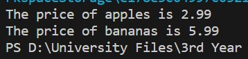

# SOFE-3650U
# Assignment 1: Design Patterns 

## Group #9

#### Kunal Pandya - 100792272

#### Kramptj KC - 100787909

#### Syed Nasir - 100809447

---

## Project Overview

- [Repository Structure](#repository-structure)
- [UML Diagram](#uml-diagram)
- [Test Driver](#test-driver)

---

## Repository Structure

```
- Arch_Assign1
	- UML
		- UML.drawio
		- UML_Diagram.png
	- src
		- data
			- data.txt
		- GroceryProductFactory.java
		- appleFactory.java
		- apples.java
		- bananaFactory.java
		- bananas.java
		- factoryProducer.java
		- products.java
	- REAME.md
	- test.java
```

## UML Diagram


## Test Driver

> test.java

```
import java.io.File;
import java.io.FileNotFoundException;
import java.util.Scanner;

public class test{

    public static void main(String[] args) {
              try {
            // Read and Scan file
            File dataFile = new File("./src/data/data.txt");
            Scanner read = new Scanner(dataFile);

            while (read.hasNextLine()) {
                String data = read.nextLine();

                // Split Product name and price
                String[] parts = data.split(" ");

                String product = parts[0];
                double price = Double.parseDouble(parts[1]);

                // Get the factory for the product
                GroceryProductFactory factory = factoryProducer.getFactory(product);
                if (factory != null) {
                    // Set the price and print the factory
                    factory.setPrice(price);
                    System.out.println(factory);
                }
            }
        read.close();    
        } catch (FileNotFoundException e) {
            System.out.println("Something went wrong -_-");
            e.printStackTrace();
        }

    }
}
```

To implement our Abstract Factory Design Pattern we created instances of `GroceryProductFactory` interface for apples and bananas using the `getFactory` method of `factoryProducer` and set their respective prices.
For printing prices, we call the `toString()` methods of the `appleFactory` and `bananaFactory` instances.
To test our error case, we made an instance of `GroceryProductFactory` for a non-existent product ("FalseValue"). This test returns null and prints "This is not a valid factory".

> test.java | Output
---

