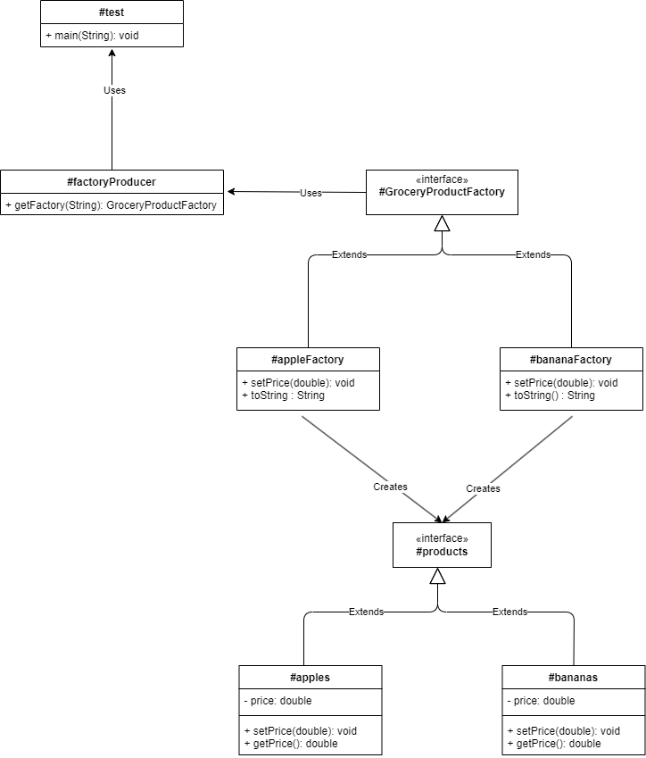
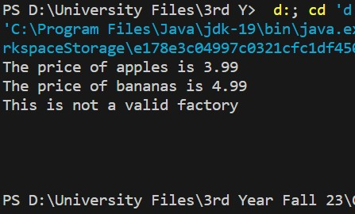

# SOFE-3650U
# Assignment 1: Design Patterns 

## Group #9

#### Kunal Pandya - 100792272

#### Kramptj KC - 100787909

#### Syed Nasir - 100809447

---

## Project Overview

- [link](#Repository Structure)
- [link](#UML Diagram)
- [link](#Test Driver)

---

## Repository Structure

```
- Arch_Assign1
	- UML
		- UML.drawio
		- UML_Diagram.png
	- src
		- data
			- data.txt
		- GroceryProductFactory.java
		- appleFactory.java
		- apples.java
		- bananaFactory.java
		- bananas.java
		- factoryProducer.java
		- products.java
	- REAME.md
	- test.java
```

## UML Diagram



## Test Driver

> test.java

```
public  class  test{

public  static  void  main(String[] args) {

	GroceryProductFactory  factory1  =  factoryProducer.getFactory("apples");

	factory1.setPrice(3.99);

	System.out.println(factory1);

	GroceryProductFactory  factory2  =  factoryProducer.getFactory("bananas");

	factory2.setPrice(4.99);

	System.out.println(factory2);

	GroceryProductFactory  factory3  =  factoryProducer.getFactory("FalseValue");

	}

}
```

To implement our Abstract Factory Design Pattern we created instances of `GroceryProductFactory` interface for apples and bananas using the `getFactory` method of `factoryProducer` and set their respective prices.
For printing prices, we call the `toString()` methods of the `appleFactory` and `bananaFactory` instances.
To test our error case, we made an instance of `GroceryProductFactory` for a non-existent product ("FalseValue"). This test returns null and prints "This is not a valid factory".
---
> test.java | Output
---

