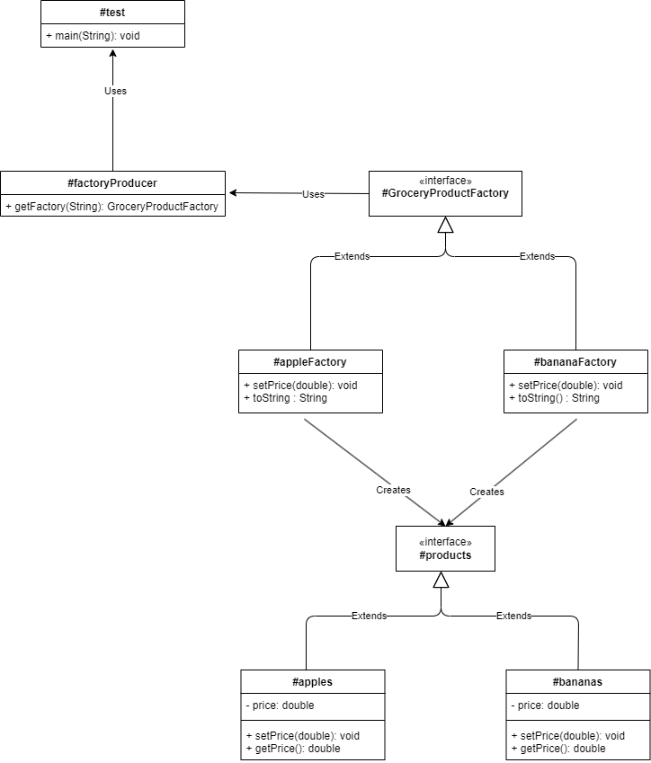
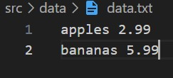

# SOFE-3650U

# Assignment 1: Design Patterns

## Group #9

#### Kunal Pandya - 100792272

#### Kramptj KC - 100787909

#### Syed Nasir - 100809447

---

## Project Overview

- [Repository Structure Details](#repository-structure)
- [UML Diagram](#uml-diagram)
- [Test Driver](#test-driver)

---

## Repository Structure Details

```
- Arch_Assign1
	- screenDumps   /* folder for screenshots  */
		- data_ss.jpg
		- Test_Output.jpg
		- UML_Diagram.png
	- src   /* Source files for all .java class files */
		- data
			- data.txt      /* Data file with preset values for products and prices */
		- GroceryProductFactory.java    /* Interface for product factories */
		- appleFactory.java     /* Implements `GroceryProductFactory` interface `*/
		- apples.java       /* Implements `products` interface */
		- bananaFactory.java        /* Implements `GroceryProductFactory` interface `*/
		- bananas.java      /* Implements `products` interface */
		- factoryProducer.java      /* Abstract Class */
		- products.java     /* Interface for products */
	- UML
		- UML.drawio
	- REAME.md
	- test.java     /* Test Driver to read & loop through `data` file. `GroceryProductFactory` instance checks products and sets price */
```

## UML Diagram



## Test Driver

> data.txt



---

> test.java

```
import java.io.File;
import java.io.FileNotFoundException;
import java.util.Scanner;

public class test{

    public static void main(String[] args) {
              try {
            // Read and Scan file
            File dataFile = new File("./src/data/data.txt");
            Scanner read = new Scanner(dataFile);

            while (read.hasNextLine()) {
                String data = read.nextLine();

                // Split Product name and price
                String[] parts = data.split(" ");

                String product = parts[0];
                double price = Double.parseDouble(parts[1]);

                // Get the factory for the product
                GroceryProductFactory factory = factoryProducer.getFactory(product);
                if (factory != null) {
                    // Set the price and print the factory
                    factory.setPrice(price);
                    System.out.println(factory);
                }
            }
        read.close();
        } catch (FileNotFoundException e) {
            System.out.println("Something went wrong -_-");
            e.printStackTrace();
        }

    }
}
```

- We test our Abstract Factory Design Pattern using a `data.txt` file that contains product names and prices.
- We read each line, split it into `product` and `price`, and store these in respective variables.
- Using the product name, we call the `getFactory` method from the `factoryProducer` abstract class to get a `GroceryProductFactory` instance.
- If the `factory` instance exists for the product, we set its `price` and print the results.
- If a `FileNotFoundException` occurs during execution of the `try` block, we `catch` it and print an error message along with the exception's stack trace.

> test.java | Output

---


